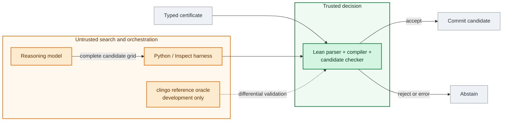
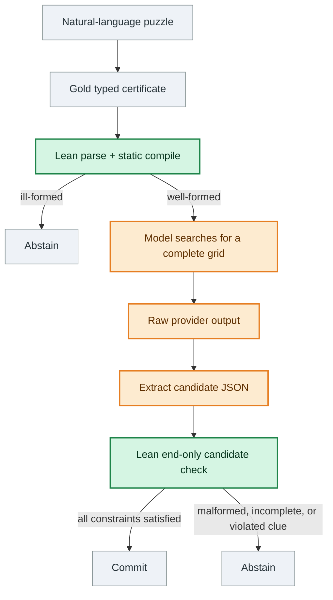
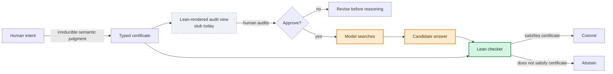
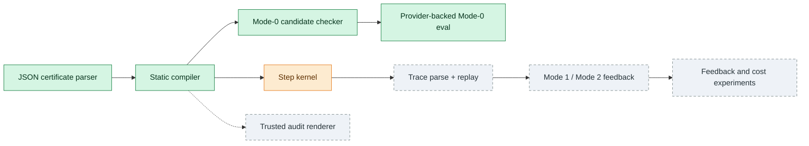
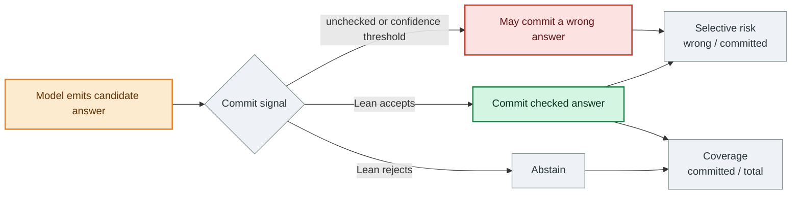
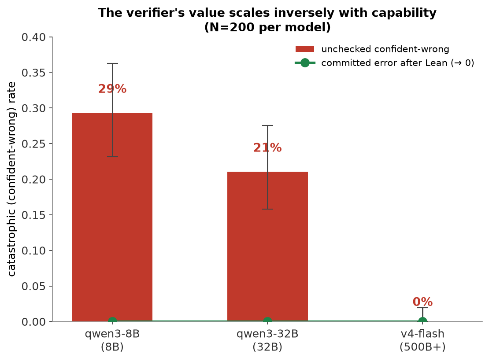
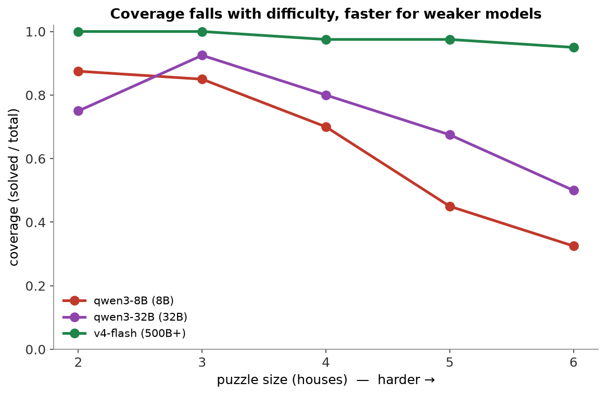

# SparseIR

**SparseIR is selective prediction for reasoning: the model searches, Lean checks, and the system commits only when the check passes.** This repository is a preliminary research artifact built around one narrow question: can a small, deterministic verifier turn silent model errors into explicit abstentions without becoming the solver itself?

> **Status: preliminary Mode-0 evidence only**
>
> The current experiments use **Mode 0**: a model emits one complete candidate grid, then Lean performs one end-only check. There is no verifier feedback, repair, or retry.
>
> The result is meaningful but narrow. It does **not** demonstrate stepwise SparseIR reasoning, verified chain-of-thought, natural-language-to-certificate faithfulness, or cost superiority. The checker does not make the model smarter; it changes the commit decision.

The present evidence comes from ZebraLogicBench puzzles with gold structured certificates. A **gold certificate** is the dataset-derived structured puzzle representation used to isolate candidate checking from natural-language parsing errors. In a 200-puzzle capability ladder, the lower-capability models produced non-trivial rates of complete but wrong grids; Lean rejected every such grid, leaving **observed 0% committed error in these runs**. A separate confidence experiment found that qwen3-8B was wrong on **18 of 31 answers it rated at least 90% likely to be correct**. A stronger model was nearly saturated on this benchmark, so the check added little there. A separate 1,000-puzzle clean run found a small residual error tail for that model. These are empirical results on a bounded domain, not a general safety guarantee.

## Contributions so far

This repository currently contributes:

1. A Lean-checked complete-candidate verification path for ZebraLogic certificates.
2. A provider-backed Mode-0 evaluation showing that Lean acceptance can be a stronger commit signal than model self-confidence.
3. A capability, difficulty, and reasoning ON/OFF analysis showing that checkable errors appear where models have lower capability, face harder grids, or lack reasoning compute.
4. A label-free evaluation discipline: raw provider outputs are retained before parsing, while Lean verdicts and failure modes are recorded before aggregate scoring.
5. An experiment-hygiene case study: an earlier dramatic result was traced to output truncation and removed as the headline.

## What is built today?

| Component | Status | What that means |
|---|---|---|
| Lean JSON parser and static compiler | **Built and tested** | Reject malformed or ill-formed certificates before checking a candidate. |
| Lean complete-candidate checker | **Built and evaluated** | Checks completeness, bijections, and all clue predicates for a supplied grid. This is the Mode-0 path used in the reported results. |
| Candidate-level clingo differential validation | **Built** | Independently compares candidate semantics against an ASP encoding during development. clingo is not in the runtime trust boundary. |
| Provider-backed evaluation harness | **Built and run** | Stores prompts, raw provider output, parsed candidates, Lean verdicts, failures, and aggregate metrics. |
| Step kernel | **Implemented, incompletely validated** | Supports local operations, but its evidence is example-based rather than a complete candidate-style differential gate. |
| Trace parser (lower JSON → Trace AST) | **Built and frozen (Stage 4)** | Frozen contract: `parse_trace` lowers a trace JSON object into a `Trace` AST and returns a structured 26-code error taxonomy. The public justification shape is a tagged union: `{clue, from?}` or `{rule: bijection, from?}` (no private kernel rule names). Replay of the parsed trace and semantic stepwise checking are **not** implemented; no end-to-end Mode-1 or Mode-2 result is claimed. The parser does not require `conclude` — that is a Stage 5 / replay concern. |
| Verifier-guided feedback and repair | **Not built** | The central feedback-granularity experiment remains future work. |
| Natural-language to certificate parser | **Not built/evaluated end to end** | Current experiments start from gold certificates. |
| Trusted human audit renderer (`Pretty.lean`) | **Stub** | `available := false`; this is a load-bearing missing component for the faithfulness story. |

## What SparseIR is testing

Reasoning systems have two separate decisions:

1. **Search:** produce a candidate answer.
2. **Commit:** decide whether that answer is safe to return.

SparseIR separates them. An untrusted model performs the expensive search. A small Lean program performs a finite check over the candidate and certificate. If the check succeeds, the system commits; otherwise it abstains.

The research question is not whether Lean can solve the puzzle. It does not search. The question is whether a checker can provide a better commit signal than the model's own confidence, and later whether structured feedback can repair failures efficiently.

The checker's value is largest where the model has a non-trivial silent-error rate: lower-capability models, harder instances, or constrained compute. At the frontier on easy instances, it may be mostly overhead; the open question is where the silent tail begins and what kind of failures appear there.

## Why this matters: tail risk, not average accuracy

SparseIR is aimed at the expensive failure mode: a model gives a complete answer that an unchecked system would commit, and that answer is wrong with no usable warning.

Average accuracy hides that failure. A model can be highly accurate and still be risky in settings where the remaining failures are hard to identify and costly to trust. The relevant question is not only “how often is the model right?” but “when it is wrong, does the system know not to commit?”

SparseIR changes that failure mode. The checker does not make the model smarter and does not find the answer itself. It turns some silent wrong answers into explicit abstentions. In this README's Mode-0 result, the check is only an end gate; the larger project asks whether verifier feedback can also repair failures rather than merely reject them.

## A tiny example

A ZebraLogic puzzle is a logic-grid puzzle. Houses occupy fixed positions, and each category assigns exactly one of its values to each house. The model's job is to search for a complete grid that satisfies every clue.

| House | Color | Drink |
|---:|---|---|
| 1 | ? | ? |
| 2 | ? | ? |
| 3 | ? | ? |

A human-readable certificate for a three-house puzzle might look like this:

```text
houses: 1, 2, 3

categories:
  Color: red, green, blue
  Drink: tea, coffee, milk

clues:
  c1: red is in house 2
  c2: red and tea are in the same house
  c3: green is directly left of red
  c4: blue and milk are in the same house

goal:
  find a complete assignment of Color and Drink to houses
```

A model searches for a complete assignment. One candidate satisfying these clues is:

```text
candidate:
  house 1: green, coffee
  house 2: red, tea
  house 3: blue, milk
```

Lean checks the supplied grid rather than deriving it. This candidate is complete, uses every value exactly once, and satisfies every clue, so the public-facing result can be summarized as:

```text
Lean result:
  ACCEPT_SOLVED
  status: solved
  claim: assignment satisfies all clues of the puzzle
```

If the model instead puts tea in house 1 and coffee in house 2:

```text
candidate:
  house 1: green, tea
  house 2: red, coffee
  house 3: blue, milk
```

Lean rejects the candidate and reports a violated clue:

```text
Lean result:
  REJECT
  status: clue_violation
  violated clue: c2
  message: candidate violates clue c2
```

Clue `c2` requires red and tea to share a house, but the rejected candidate places them in houses 2 and 1. In the current Mode-0 experiments, this is the whole loop: the model emits one complete grid; Lean accepts it or the system abstains. Model reasoning text is untrusted and is not verified. Stepwise traces and verifier-guided repair are not part of the current public result.

Internally, the verifier consumes structured JSON. The certificate above is a manually written illustration of the **intended** human audit rendering of that same structured object; it is not output from a separate parser or from a completed renderer. The trusted audit view must eventually be rendered by Lean from the same parsed AST that the checker verifies. `Pretty.lean`, the component intended to do that, is still a stub.

## How it works

### Trust boundary

Only Lean decides whether a candidate is accepted. Models, Python orchestration, provider APIs, prompts, and the development oracle are untrusted.



Green marks the trusted Lean decision path; orange marks components that may be wrong but cannot override a rejection.

The dataset's expected solution is not part of the acceptance decision. Evaluation labels are applied after the raw output and Lean verdict have been recorded. Python cannot override a Lean rejection.

### Current Mode-0 data flow



The natural-language-to-certificate arrow is intentionally not claimed as a built model pipeline. Gold certificates isolate the candidate-checking experiment from semantic parsing errors.

### Checker, not solver

For a supplied grid, Lean checks that every category is a bijection over houses and that each typed clue predicate is satisfied. It does not enumerate assignments, call a solver, consult the gold answer, or repair the grid. This asymmetry keeps the trusted decision small and inspectable.

Candidate-level clue semantics were tested against an independent clingo encoding. That differential test is evidence about this bounded implementation; it is not a proof that the certificate matches human intent, nor does it establish the same validation depth for stepwise operations.

## What Lean guarantees, and what it does not

Given the code and certificate supplied to it, Lean verifies:

- the certificate parses and passes static well-formedness checks;
- the candidate is complete and bijective for the declared grid;
- the candidate satisfies every compiled clue;
- rejection is fail-closed and cannot be overridden by the model or harness.

Lean verifies **“this answer satisfies this certificate.”** It does not verify **“this certificate captures what the human meant.”** Those are different claims.

### Faithfulness and the human audit surface

SparseIR has two different failure layers:

```text
human intent  --framing-->  typed certificate  --reasoning-->  answer
```

Lean can check the second layer: given a certificate, does the candidate answer satisfy it? That is the machine-checkable reasoning tail, and it is the part this README evaluates.

Lean cannot check the first layer: whether the certificate captures what the human meant. A parser can mistranslate a clue while still producing a well-formed certificate, and Lean would then check the wrong formal problem correctly. SparseIR therefore does not claim to solve natural-language-to-formal faithfulness.

The design goal is to relocate that irreducible semantic judgment. Instead of asking a human to audit a long chain-of-thought after the fact, SparseIR should expose a compact typed certificate before reasoning compute is spent. A person can reject the framing early: “no, clue 3 is wrong.” This does not close the faithfulness gap; it moves it to the cheapest and most legible point.

That design depends on the audit view being rendered by the trusted layer. Otherwise a user could approve text that differs from what Lean checks. The intended Lean-rendered view, `Pretty.lean`, is currently a stub. Building it, then measuring whether people detect injected mistranslations or instead become complacent around a “verified” label, is required work rather than polish.



## Current implementation and target architecture



Mode 0 gates a completed answer. The target system adds two feedback regimes: Mode 1 would replay a complete trace and return the first invalid step; Mode 2 would check one operation at a time. Neither repair loop has been demonstrated.

## Research map

Mode 0 is not the full SparseIR thesis. It is the first narrow slice: a model emits a complete candidate, and Lean decides whether that candidate can be committed.

The larger project asks whether models can reason in compact, checkable SparseIR operations, whether Lean feedback can repair failures efficiently, and whether typed certificates make the remaining semantic gap easier for humans to audit.

| Area | Question | Current status |
|---|---|---|
| Verification / abstention | Can Lean turn complete-but-wrong answers into abstentions? | Preliminary Mode-0 support |
| Model confidence | Is self-reported confidence a good enough commit signal? | Preliminary evidence says no; stronger uncertainty baselines remain |
| Difficulty scaling | Does checker value appear where models have lower capability, reasoning is OFF, or grids are harder? | Preliminary descriptive support |
| SparseIR-native reasoning | Do models reason better or more cheaply in SparseIR traces than free-text CoT? | Untested |
| Verifier feedback | Do first-failure or stepwise Lean reports repair failures better than best-of-N? | Untested |
| Parser faithfulness | Does natural language to certificate translation preserve the intended task? | Untested; current results use gold certificates |
| Human audit | Do people catch certificate misframings, and does a “verified” label cause over-trust? | Untested |
| Cost efficiency | Does a cheap model plus Lean beat frontier reasoning at fixed precision? | Untested |
| Tactics / recursion | Do high-level tactics or checked subproblem reuse reduce cost? | Untested |
| Swappable verifier backend | Can the checker interface support Lean or another verified or specialized backend without changing the evaluation harness? | Designed in the spec; v0 uses Lean only |
| Model self-check | Can a model's own self-verification approximate the checker closely enough to become useful as a baseline or fallback signal? | Untested; not trusted for commits in v0 |

The larger architecture is checker-interface-first, not necessarily Lean-only forever. v0 uses Lean as the only trusted backend, but the spec defines a backend contract so the harness can eventually route the same abstract operations to another trusted checker. Such a backend would need deterministic verdicts, a clear result vocabulary, and its own validation gate before it could produce committed results. Model self-check is different: it may become a useful comparison, fallback, or calibration signal if models improve, but it is not equivalent to a trusted checker and cannot replace Lean as the commit judge in v0.

This README reports a checked selective-prediction result, not the completed SparseIR architecture.

## Metrics

- **Coverage:** fraction of examples where Lean accepts and the system commits the candidate.
- **Confident-wrong:** a parseable candidate emitted as the model's answer that violates the certificate and would have been committed without Lean. This measures answer behavior, not elicited confidence.
- **High-confidence wrong:** an answer that is wrong despite the model assigning it a high P(True), reported here at the ≥0.9 threshold.
- **Committed error:** wrong answers among candidates accepted by Lean.
- **Abstention:** any malformed, incomplete, clue-violating, or otherwise rejected output.



Different commit signals select different operating points: stricter gating can reduce selective risk by abstaining more often, at the cost of coverage.

## Preliminary Mode-0 findings

All headline runs use gold certificates and one end-only Lean check.

### Capability ladder

| Model | Solved / 200 | Coverage | Confident-wrong among parseable answers | Committed error after Lean |
|---|---:|---:|---:|---:|
| qwen3-8B | 128 | 64.0% | 53 / 181 = **29.3%** | **0%** |
| qwen3-32B | 146 | 73.0% | 39 / 185 = **21.1%** | **0%** |
| deepseek-v4-flash | 196 | 98.0% | 0 / 196 = **0%** | **0%** |

The v4-flash ladder result should not be read as proof of zero tail risk. A separate clean 1,000-puzzle run measured 95.9% coverage and about **1.0% confident-wrong among parseable answers**. The ladder was too easy to expose that small tail reliably.



### High-confidence answers were often wrong

A separate call elicited **P(True)**, the model's estimate that its own answer was correct.

| Model | Answers with P(True) ≥ 0.9 | Wrong among them | Interpretation |
|---|---:|---:|---|
| qwen3-8B | 31 | **18 / 31 = 58.1%** | High confidence was anti-informative; raising the threshold did not recover Lean's zero-risk point. |
| qwen3-32B | 139 | **13 / 139 = 9.4%** | Confidence was weak/flat, and the call was confounded by partial re-reasoning. |
| v4-flash | 18 | **0 / 18 = 0%** | The model was strongly under-confident, so confidence thresholds could not approach Lean's coverage. |

For v4-flash, mean P(True) was 0.106 and even the lowest reported threshold covered only 13.8% of parseable rows, far below Lean's 98% coverage. The absence of high-confidence errors on this ladder therefore does not make its confidence useful as a matched-coverage commit signal.

P(True) is a deliberately limited baseline, not the strongest possible uncertainty method. Log-probability, consistency, and learned confidence baselines remain to be tested.

### Reasoning ON vs OFF, not a graded cap experiment

The provider did not honor the requested intermediate maximum reasoning-token settings. The apparent cap sweep therefore cannot support a graded reasoning-budget claim. The valid comparison is only **reasoning ON vs reasoning OFF**.

With reasoning OFF, v4-flash coverage was 88%; with reasoning ON, it was 96%. The effect was concentrated on harder puzzles: 2–3-house puzzles remained 40/40 in both conditions, while 6-house puzzles fell from 35/40 with reasoning ON to 25/40 with reasoning OFF. Confident-wrong rates rose primarily on 5–6-house grids. Across the capability ladder, coverage also fell faster with grid size for lower-capability models. Together these results suggest that errors appear where the model is outmatched, but they do not establish a dose-response curve for reasoning tokens.



### Contamination smoke

Forty puzzles were transformed by renaming values and permuting house order, then rechecked for uniqueness. The transformed and paired-original solve rates were both 36/40, with zero observed regurgitations of the original answer. This removes one obvious memorization signature; it does not prove absence of benchmark contamination.

### The earlier dramatic result was a measurement artifact

An earlier v4-flash run reported 39.5% confident-wrong. Investigation traced most of that result to an approximately 1,800-token output cap that truncated reasoning on larger grids. With an adequate output budget, the error rate fell to roughly 1–4%, depending on the run.

That result is not the headline. It is retained as an experimental lesson: output limits were a confound, the diagnosis changed the thesis, and subsequent experiments separated capability, difficulty, and usable reasoning budget more carefully.

## Why I trust the current result

The conclusion is narrow because the experiment is structured to make overclaiming difficult:

- **Lean is the sole commit judge.** Gold labels and model confidence do not enter acceptance.
- **Raw-output discipline.** Provider output is stored before extraction and scoring; malformed answers remain visible rather than being silently repaired.
- **Label-free checking.** The candidate checker does not read the expected solution.
- **Independent semantic validation.** Candidate clue predicates are differentially tested against clingo, which is development-only and outside the runtime trust boundary.
- **Failure accounting.** Solved, clue-violating, malformed, invalid, provider-failed, and truncated cases are separated.
- **Confounds are reported.** The truncation-confounded headline was withdrawn; the failed intermediate cap manipulation is reported only as reasoning ON vs OFF; and qwen3-32B re-reasoning is an explicit limitation.
- **Artifacts are committed.** Configurations, per-example results, metrics, failures, and summaries are inspectable under `eval/gates/`.

## What this does not claim

SparseIR does not yet show:

- verified chain-of-thought;
- general theorem proving;
- solved natural-language-to-certificate faithfulness;
- stepwise verifier-guided repair;
- **H1:** representation value from SparseIR traces or certificates;
- **H4:** a feedback-granularity result across end-only, first-failure, and stepwise modes;
- **H5:** cost superiority over frontier models;
- a non-Lean trusted backend;
- model self-check as a trusted replacement for Lean;
- a full natural-language parser, certificate audit, trace, and repair pipeline.

It also does not establish a universal zero-error system. The 0% figure is the observed committed error in these finite Mode-0 runs, conditional on the supplied certificate and implemented checker semantics.

## What would weaken this direction?

The current thesis would become less interesting if:

- stronger uncertainty baselines matched Lean's risk-coverage operating point;
- Mode-1 or Mode-2 feedback failed to improve coverage over simple best-of-N resampling at matched cost;
- harder frontier-scale instances produced mostly malformed or hedged failures rather than complete, checkable wrong candidates;
- human audit of trusted certificate renderings failed to improve detection of parser misframings.

## Immediate next experiment

The next decisive experiment is **Mode 1 vs best-of-N** on the same model, puzzle split, and total token budget:

- Mode-0 best-of-N samples multiple complete grids and accepts the first one Lean verifies;
- Mode 1 replays a trace, returns Lean's first-failure report, and gives the model one budget-matched repair opportunity.

This tests whether verifier feedback adds useful information beyond rejection sampling. It requires the trace parser/replay seam and first-failure protocol to be completed first.

## Next steps

1. Build trace replay and the first-failure protocol on top of the frozen Stage 4 trace-parser contract (`SparseIRLean/Trace.lean`), then run Mode-1 and Mode-2 repair experiments against blind resampling, with matched budgets.
2. Close the stepwise semantic-validation gap against an independent reference.
3. Build the trusted `Pretty.lean` audit renderer and evaluate human detection of certificate mistranslations and automation complacency.
5. Move beyond ≤6-house ZebraLogic to measure the residual tail on instances that challenge frontier models.
6. Compare against stronger uncertainty baselines with multiple seeds.
7. Only then measure end-to-end cost, including parsing, checking, retries, abstentions, and frontier baselines.

## Reproduce and inspect artifacts

Requirements: Lean 4 via the pinned toolchain, Python 3.11+, and `uv` or an equivalent Python environment manager. All research evidence links below are repository-local.

### Inspect the committed evidence

These artifacts contain the experiment configuration, per-example results, separated failure cases, aggregate metrics, and human-readable summaries. No provider credentials are needed to inspect them:

- [Capability ladder](eval/gates/stage6_capability_ladder/summary.md): [metrics](eval/gates/stage6_capability_ladder/metrics.json), [per-example results](eval/gates/stage6_capability_ladder/results.jsonl), and [failures](eval/gates/stage6_capability_ladder/failures.jsonl)
- [P(True) confidence comparison](eval/gates/stage6_h3_confidence/summary.md): [metrics](eval/gates/stage6_h3_confidence/metrics.json) and [per-example results](eval/gates/stage6_h3_confidence/results.jsonl)
- [Reasoning ON/OFF comparison](eval/gates/stage6_budget_sweep/summary.md): [metrics](eval/gates/stage6_budget_sweep/metrics.json) and [per-example results](eval/gates/stage6_budget_sweep/results.jsonl). Intermediate cap settings were not honored and should not be interpreted as a graded sweep.
- [Contamination perturbation smoke](eval/gates/stage6_contamination/summary.md): [metrics](eval/gates/stage6_contamination/metrics.json) and [per-example results](eval/gates/stage6_contamination/results.jsonl)
- [Mode-0 pilot and artifact schema](eval/gates/stage6_mode0_h2_h3/summary.md)
- [Stage 4 trace-parser gate and freeze record](eval/gates/stage4_trace_parser/FREEZE.md): frozen `parse_trace` contract, 26-code error taxonomy, 26/26 parser fixtures, real JSON-Schema ↔ Lean-parser parity gate (122 boundary cases, zero disagreements), 140 positive + 120 adversarial provider-evidence samples reparse, 36-sample stepwise trace-shape diagnostic with public-rule-only prompt (zero private-rule leakage)
- [Candidate-level differential checker test](tests/test_stage3b_differential_candidates.py)

For example:

```bash
# Pretty-print aggregate capability-ladder metrics.
uv run python -m json.tool eval/gates/stage6_capability_ladder/metrics.json

# Pretty-print the first retained per-example result.
uv run python -c "import json, pathlib; p=pathlib.Path('eval/gates/stage6_capability_ladder/results.jsonl'); print(json.dumps(json.loads(p.open(encoding='utf-8').readline()), indent=2))"
```

### Run a fresh provider-backed smoke

After setting `OPENROUTER_API_KEY`, this runs a small balanced sample with reasoning ON, retains raw responses, checks every candidate in Lean, and writes results outside the committed gate directories:

```bash
uv run python scripts/run_stage6_cheap_smoke.py --output-dir .local/stage6-smoke --per-bin 1 --workers 1
```

Historical provider generations are not bit-reproducible: model endpoints and routing can change. The public tree commits configurations, parsed candidates, Lean verdicts, failure records, metrics, and manifests. Raw provider responses were retained before parsing during the runs but are not included in the public checkout; a fresh smoke stores its own raw responses under the selected output directory.

Full gate entrypoints live under `scripts/run_stage6_*.py`; they write to canonical gate directories, so use a disposable branch or checkout rather than overwriting the committed run.

### Re-run the checker validation offline

These focused gates exercise complete-candidate acceptance/rejection and compare Lean's candidate semantics against the independent clingo encoding without making provider calls:

```bash
lake build
uv sync --dev
uv run pytest tests/test_stage3a_candidate_checker.py tests/test_stage3b_differential_candidates.py
```

### Build and test the implementation

```bash
lake build
lake test
uv sync --dev
uv run pytest
```

The Python harness is orchestration, not part of the trusted checker.

## Repository map

| Path | Role |
|---|---|
| `SparseIRLean/Json.lean` | Strict problem-envelope and certificate parsing |
| `SparseIRLean/Compiler.lean` | Static checks and compilation to the internal puzzle form |
| `SparseIRLean/CheckerCore.lean` | Complete-candidate Mode-0 semantics |
| `SparseIRLean/StepKernel.lean` | Experimental stepwise kernel (unbuilt for Mode 1/2 reuse) |
| `SparseIRLean/Trace.lean` | Frozen trace parser (Stage 4) — `parse_trace` lowers a trace JSON into a `Trace` AST and returns a structured 26-code error taxonomy. The public justification shape is a tagged union (`{clue, from?}` or `{rule: bijection, from?}`). |
| `SparseIRLean/Main.lean` | Fail-closed JSON CLI |
| `SparseIRLean/Pretty.lean` | Trusted audit-renderer stub |
| `src/sparseir_harness/` | Untrusted datasets, orchestration, scoring, and reference tooling |
| `eval/gates/` | Committed experiment configurations, outputs, metrics, and summaries |
| `tests/` | Interface, checker, differential, dataset, and harness tests |

The current public result is a checked selective-prediction result, not the completed SparseIR architecture: **the model searches, Lean checks, and the system commits only when the check passes.**
